# Hydrological Model Validator

## Overview

# Northern Adriatic Sea Model Post-Processing

This project is developed to **read, interpolate, analyze, and validate** the output of a **coupled physical–biogeochemical model** for the **Northern Adriatic Sea**.

The **physical component** of the simulation is powered by the [**NEMO General Circulation Model**](https://www.nemo-ocean.eu/), while the **biogeochemical processes** are simulated using the [**BFM Biogeochemical Flux Model**](https://www.cmcc.it/models/biogeochemical-flux-model-bfm). The BFM includes an **explicit benthic-pelagic coupling**, capturing the dynamics at the **sediment–water interface**.

This **GitHub repository** focuses specifically on the **post-processing** of model outputs. It provides tools to:

- Clean and pre-process relevant **satellite data**,
- Interpolate missing fields in satellite observations,
- Compare satellite and model outputs for validation purposes.

The satellite data used in this project is sourced via request from the [**Copernicus Marine Service**](https://marine.copernicus.eu/) and shares the same spatial grid as the model output. Two satellite **data levels** are utilized:

- **Level 3**: Raw observation data; missing values (e.g., due to cloud cover) are left unfilled, resulting in data gaps.
- **Level 4**: Includes interpolated data, where missing values are filled using methods such as basin-wide averaging.

Once the data is processed, two main **analysis and validation** scripts are available:

- **Sea Surface Temperature (SST) Analysis**
- **Chlorophyll-a Concentration Analysis**

---

This repository is part of a **Physics of the Earth System** thesis and may be expanded in the future to include additional variables and more advanced analysis features.

---

## Project Structure

The project is organized into two primary components:

### 1. Data Setup

This section handles the preparation of both model and satellite datasets:

- Reading and importing of model and satellite data;
- Identification of missing values and missing days;
- Interpolation of incomplete fields using:
  - **Level 3 data** (reconstructed using model data);
  - **Level 4 data** (reconstructed using satellite-derived estimates);
- Computation of **basin-average time series** for both SST and CHL datasets.

### 2. Data Analysis & Validation (SST and CHL)

This section provides tools for both exploratory analysis and quantitative validation.

#### Analysis Tools

- Time series plotting  
- Bias visualization  
- Seasonal and global scatter plots  

#### Validation Tools

- **Taylor diagrams**
- **Target plots**
- Coefficient of Determination:
  - Regular
  - Weighted
- Index of Agreement:
  - Regular
  - Modified
  - Relative
- Nash–Sutcliffe Efficiency:
  - Regular
  - Logarithmic
  - Modified
  - Relative

### 3. Benthic Layer Analysis

- Density field computation using:
  - Simplified Equation of State
  - Equation of State for the Seawater (1980)
  - Thermodynamic Equation of State (2010)
- Extraction of the Biocheochemical indices at the Benthic Layer and the Sea Surface

---

## Installation and explanation of the scripts

The necessary scripts for **data preprocessing**, **analysis**, and future **biogeochemical exploration** are provided in this repository.

---

### `Data_reader_setupper.py`

This script retrieves and processes the required **satellite datasets**, identifying both **missing days** and **gaps** within the time series. The cleaned data can be saved either as a single `.mat` file or as multiple `.nc` files, depending on user preference.

Due to limitations in replicating the interpolation process in Python, a dedicated **MATLAB** script is included for bilinear interpolation of **model data onto the satellite grid**. Future updates may include an option to choose between interpolating model data onto the satellite grid or self-interpolating the satellite dataset to fill gaps.

---

### `SST_data_analyzer.py` & `CHL_data_analyzer.py`

These scripts analyze **Basin Average** time series for **Sea Surface Temperature (SST)** and **Chlorophyll (CHL)** fields, evaluating model performance against satellite observations.

The analysis includes:
- Bias detection (seasonal and overall)
- Scatter plots and time series comparisons
- Hydrological model validation using a suite of **efficiency metrics**, based on methodologies described by Krause et al. (see the Bibliography).

---

### `Benthic Layer Analysis Script`

The `Benthic_layer.py` script extracts the depth value of the Benthic Layer from the dataset. With this depth information, the script uses it as a key coordinate to pull out relevant fields. These fields are then visualized through various plots, allowing for further exploration and analysis of the data.

The script then uses these fields to compute the **Density** field from the **Temperature** and **Salinity** values derived from the **BFM** simulation by applying three different **Equations of State** to the data. These include:

- **Simplified Equation of State**
- **Equation of State for Seawater (1980)**
- **Thermodynamic Equation of State (2010)**

The use of multiple equations allows for a comparative analysis of how each performs in representing the water density.

---

## Required Python Libraries

Make sure that these libraries are installed in the environment before running the scripts.

### Standard Library Modules
These are included with Python and require no installation:

- `os`
- `sys`
- `gzip`
- `shutil`
- `calendar`
- `datetime`
- `warnings`
- `pathlib`
- `cryptography`

### Third-Party Libraries
Install these using `pip` or conda if they are not already available in your environment:

- [`numpy`](https://numpy.org/)
- [`pandas`](https://pandas.pydata.org/)
- [`xarray`](https://docs.xarray.dev/)
- [`matplotlib`](https://matplotlib.org/)
- [`netCDF4`](https://unidata.github.io/netcdf4-python/)
- [`scipy`](https://scipy.org/)
- [`skill_metrics`](https://github.com/PeterRochford/skill_metrics)
- [`scikit-learn`](https://scikit-learn.org/)
- [`statsmodels`](https://www.statsmodels.org/)
- [`re`](https://docs.python.org/3/library/re.html)
- [`gsw`](https://pypi.org/project/gsw/)

---

## The Test Case

Alongside a **pytest** file for the computational functions a test case is provided to test the plotting functions.

The **test case** file are the **satellite data** and **model data** for the **year 2000**. Here are a couple of example outputs of the plots generated using the code:

### Basin Average timeseries

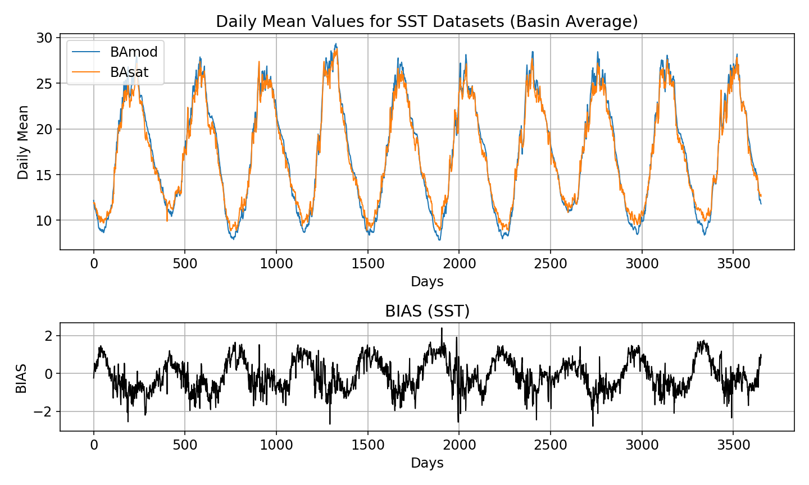
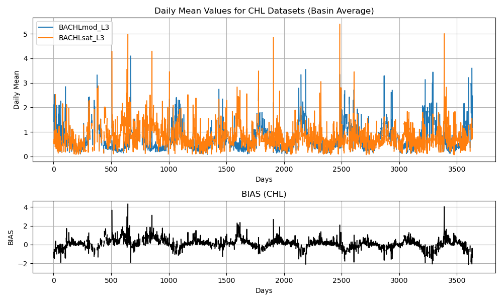

### Seasonal Scatterplots (both global and seasonal)

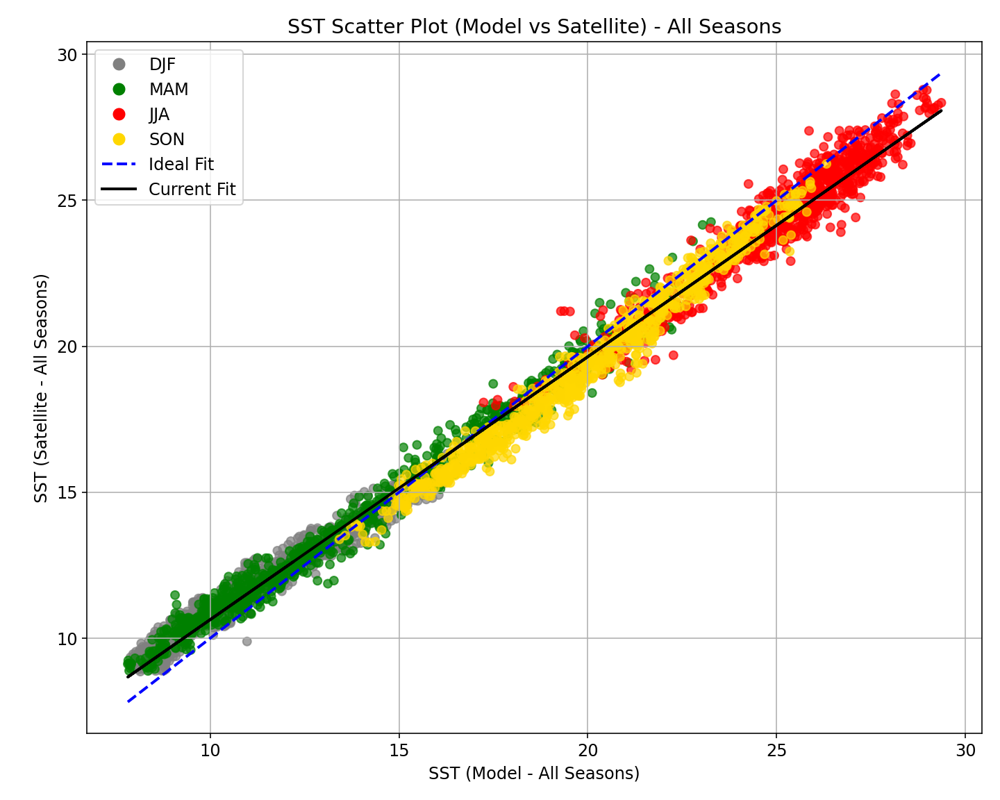
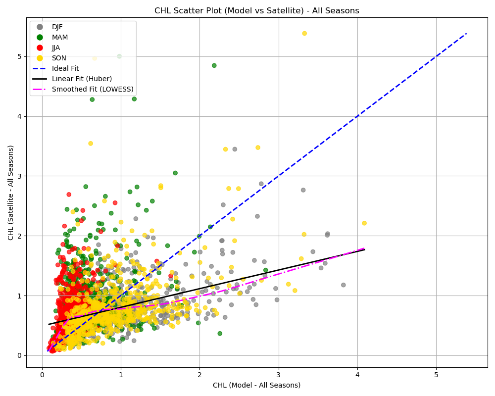

### 2D maps

### Taylor Diagrams (both yearly and monthly)

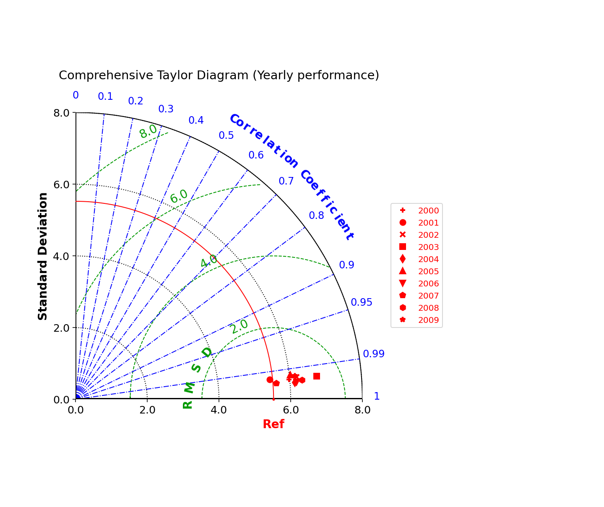

### Target Plots (both yearly and monthly)

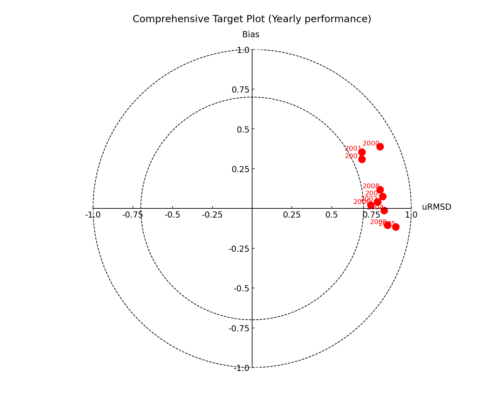

### Efficiency Metrics

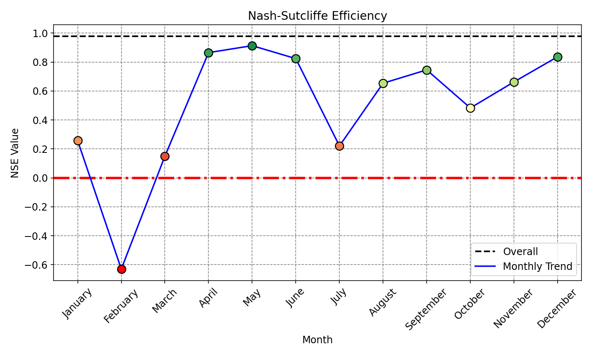

### 2D Deep Water Density Fields

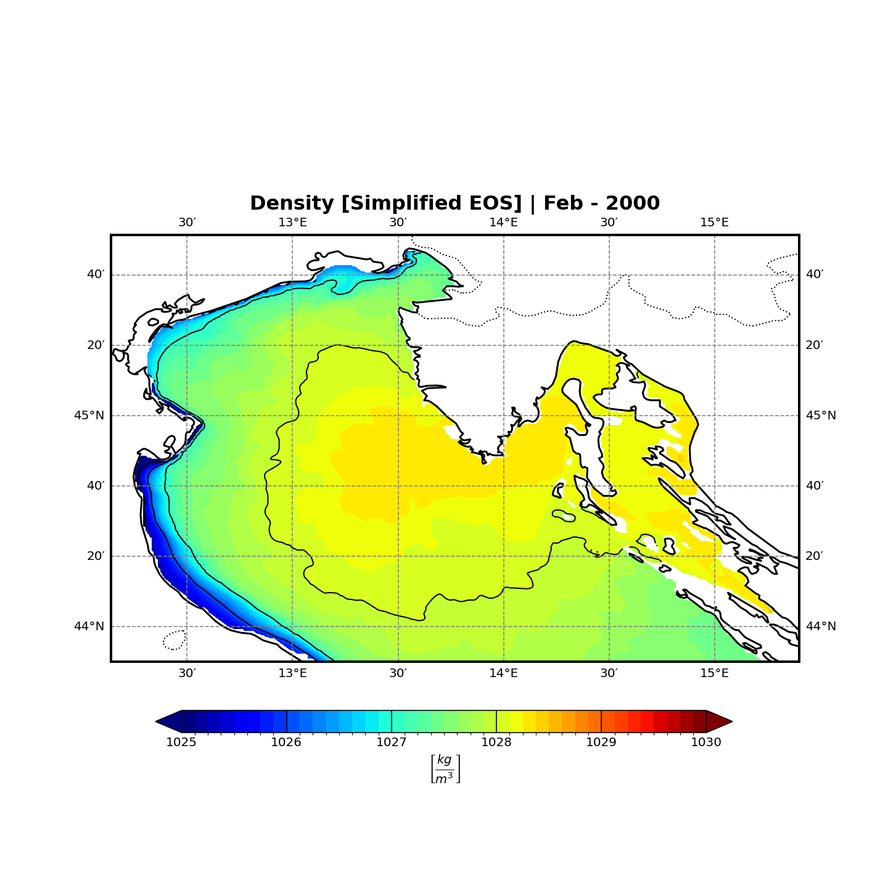
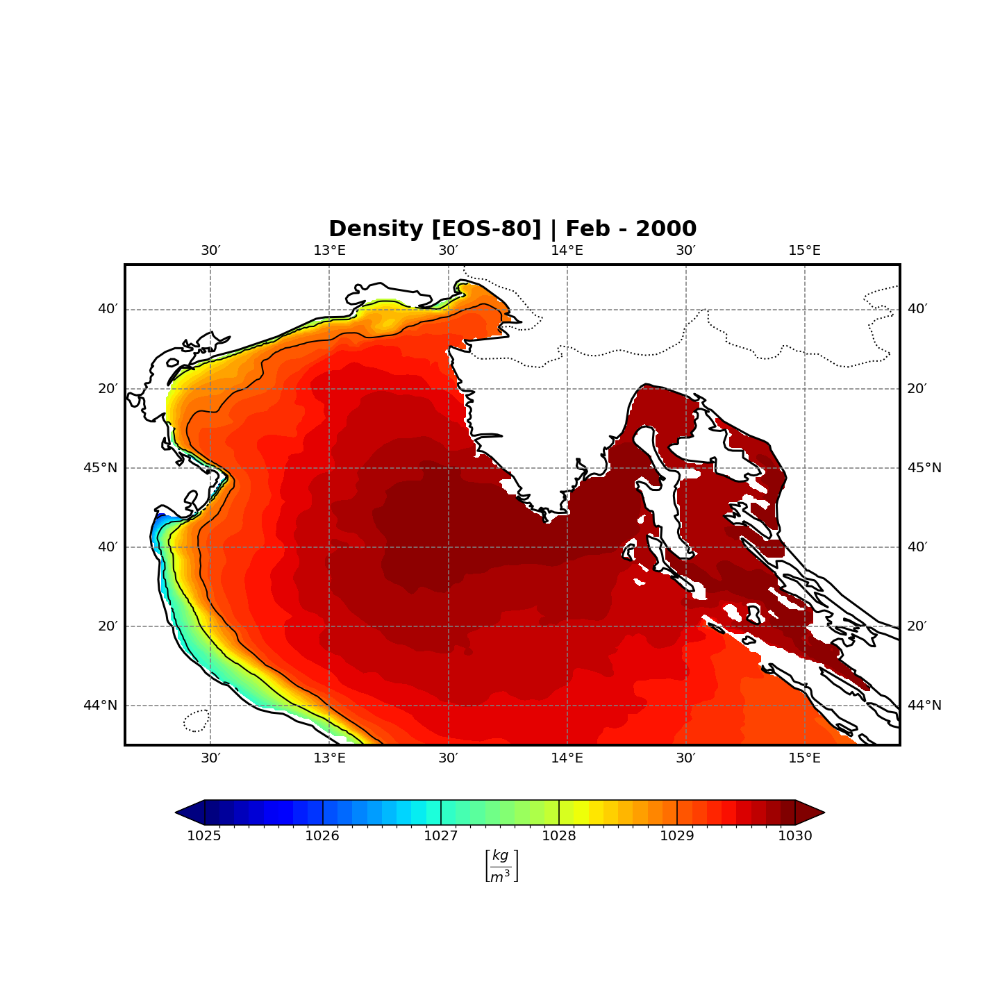
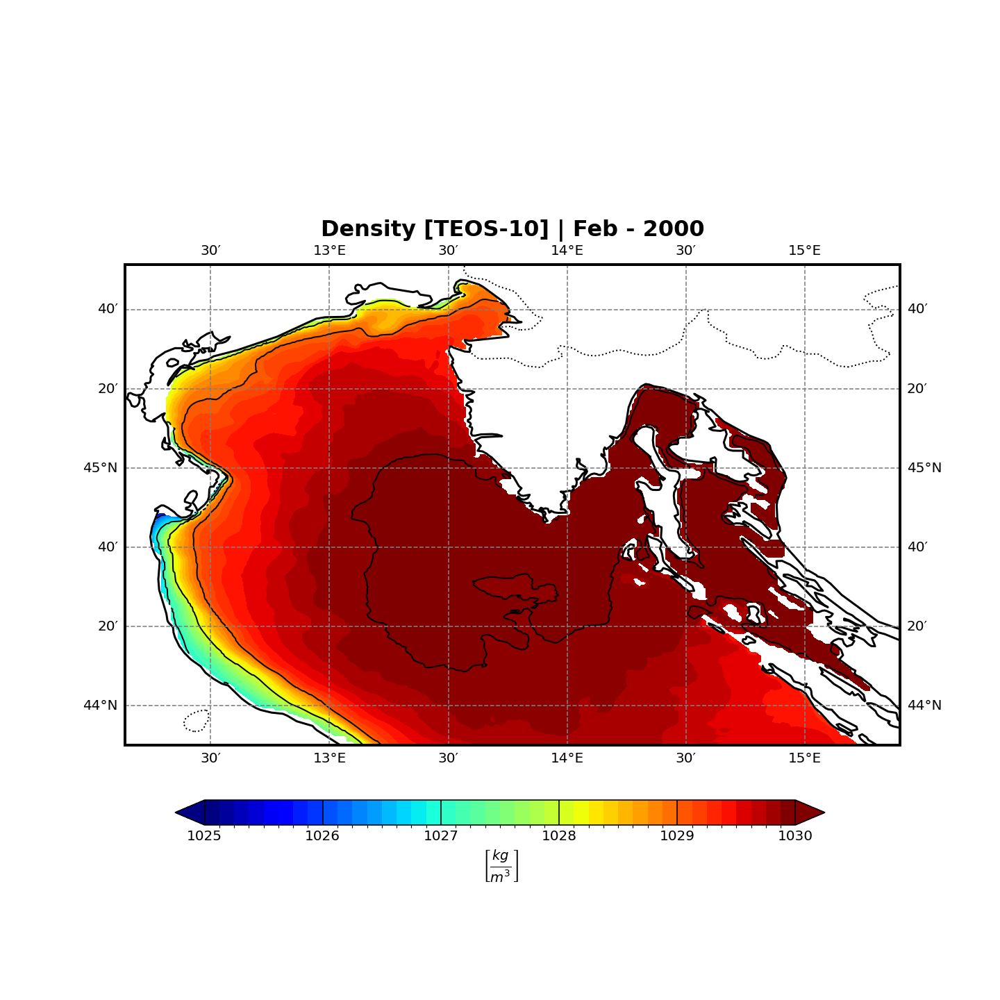

### Benthic Layer Computation

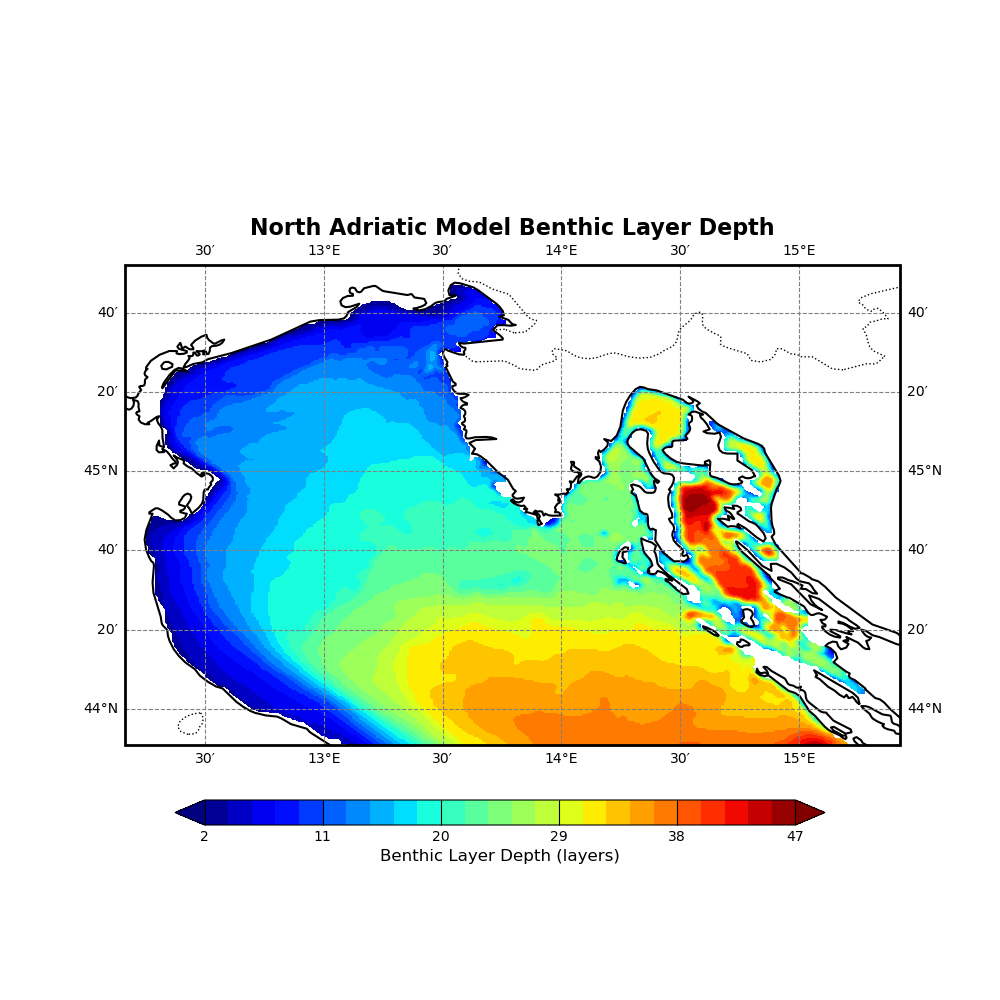

### 2D Biogeochemical Map at the Benthic Layer

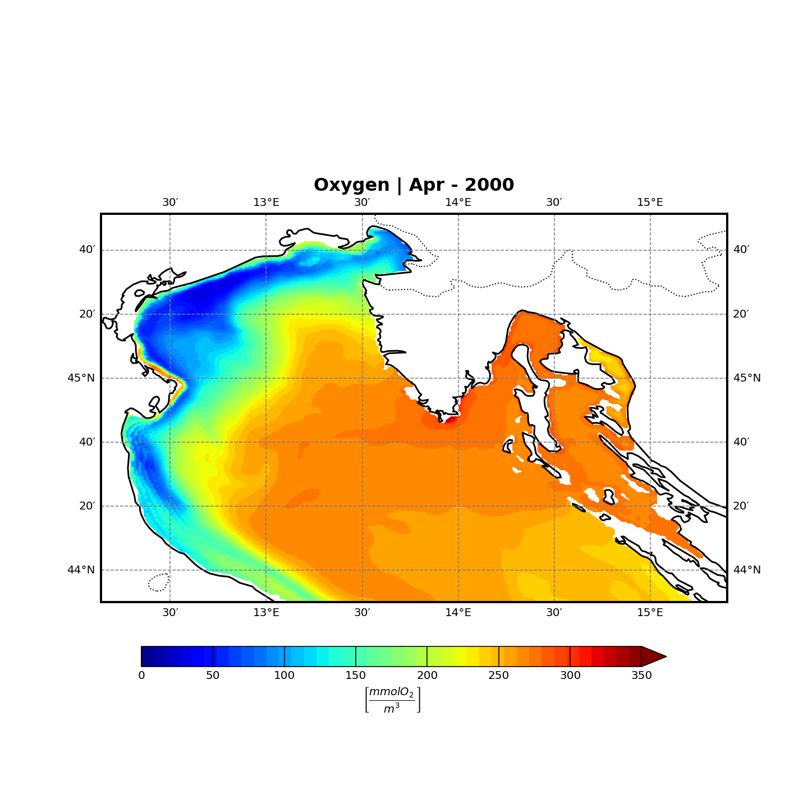

---

# Bibliography

[**The Northern Adriatic Forecasting System for Circulation and Biogeochemistry: Implementation and Preliminary Results (Scroccaro I et al., 2022)**](https://www.researchgate.net/publication/363410921_The_Northern_Adriatic_Forecasting_System_for_Circulation_and_Biogeochemistry_Implementation_and_Preliminary_Results)

[**Comparison of different efficiency criteria for hydrological model assessment (Krause P. et al., 2005)**](https://www.researchgate.net/publication/26438340_Comparison_of_Different_Efficiency_Criteria_for_Hydrologic_Models)

[**Summary diagrams for coupled hydrodynamic-ecosystem model skill assessment (Jolliff et al., 2008)**](https://www.researchgate.net/publication/222660103_Summary_diagrams_for_coupled_hydrodynamic-ecosystem_model_skill_assessment)

[**The International Thermodynamic Equation of Seawater 2010 (TEOS-10): Calculation and Use of Thermodynamic Properties (McDougall et al., 2010)**](https://www.researchgate.net/publication/216028042_The_International_Thermodynamic_Equation_of_Seawater_2010_TEOS-10_Calculation_and_Use_of_Thermodynamic_Properties)

[**Defining a Simplified Yet “Realistic” Equation of State for Seawater (Roquet et al., 2015)**](https://journals.ametsoc.org/view/journals/phoc/45/10/jpo-d-15-0080.1.xml?utm_source=chatgpt.com)
