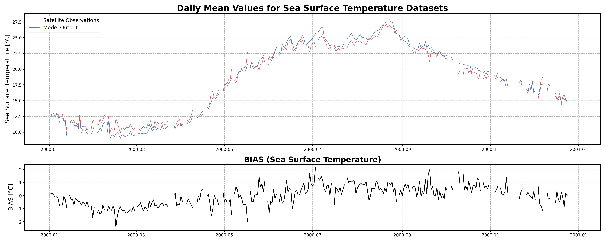

# Overview of Test Cases

This repository includes four test cases that demonstrate example usage of the core functions provided.

Specifically, the test cases are:

- **Data_reader_setupper.py** — Illustrates the steps and processes required to clean and prepare data for subsequent analysis.
- **CHL_data_analyzer.py** and **SST_data_analyzer.py** — Show how to generate evaluation reports and validate simulation outputs using Chlorophyll-a and Sea Surface Temperature data respectively.
- **Benthic_Layer.py** — Demonstrates an extended analysis focused on the bottom (benthic) layer of the simulation.

Each test case can be executed via the command line using its respective entrypoint:

| Entrypoint      | Description                                   |
|-----------------|-----------------------------------------------|
| `sst-analyze`   | Runs the Sea Surface Temperature test case    |
| `chl-analyze`   | Runs the Chlorophyll-a test case               |
| `bfm-analyze`   | Runs the Benthic Layer test case               |
| `data-setupper` | Runs the data cleaning and preparation script |

All entrypoints are automatically installed when installing the package via `pip` (see the Installation Guide in the main README).

---

## Test Data Explanation

The test data provided consists of a 1 year dataset extracted from a 10-year simulation subset focused on the North-Adriatic basin.

The simulation was run on the [**OPH DIFA**](https://apps.difa.unibo.it/wiki/oph:cluster:startupguide) cluster and is based on a **NEMO-BFM** coupled model, designed to capture both physical and biogeochemical processes within the basin.

- The **physical component** utilizes the [**NEMO General Circulation Model**](https://www.nemo-ocean.eu/).
- The **biogeochemical processes** are simulated with the [**BFM Biogeochemical Flux Model**](https://www.cmcc.it/models/biogeochemical-flux-model-bfm), which includes an explicit benthic-pelagic coupling to represent dynamics at the **sediment–water interface**.

Observed data are sourced from satellite products provided by the [**Copernicus Marine Service**](https://marine.copernicus.eu/) and share the same spatial grid as the model output.

- The Chlorophyll-a satellite data is a 1km × 1km native daily dataset.
- The Adjusted Sea Surface Temperature data is originally at 0.05° × 0.05° resolution but has been resampled using CDO (Climate Data Operator) with a nearest-neighbor method to 1km × 1km, ensuring grid alignment between observed and model data.

Two satellite **data levels** are supported by the test cases:
- **Level 3:** Raw observations with missing values (e.g., due to cloud cover) left unfilled, resulting in data gaps.
- **Level 4:** Interpolated data where missing values are filled using methods such as basin-wide averaging.

> Note: Level 4 analysis was included in previous test case versions but has been deprecated due to very poor performance.

For the Benthic Layer analysis, the extracted data has been aggregated to monthly averages to limit dataset size. Currently, only the **grid-t** and **grid-bfm** datasets are provided, as these are the ones utilized in the test cases.

---

# `data-setupper` Test Case

Running the **data-setupper** test case allows the user to prepare data for subsequent analysis. This test case processes only one variable at a time—either SST (Sea Surface Temperature) or CHL (Chlorophyll-a)—and handles a single satellite data level (L3 or L4, although L4 is currently deprecated).

While memory usage is generally manageable with the provided test data, handling datasets spanning 10+ years can be demanding. To prevent crashes, the test case is intentionally designed to avoid processing multiple variables or levels simultaneously.

The test script performs several operations to read and clean satellite data, addressing potential inconsistencies in the timeseries and filling missing values. This preprocessing is crucial, as raw data issues could otherwise disrupt direct comparisons with simulated outputs.

Data can be saved in various file formats; however, only the `.mat` format enables the use of the MATLAB interpolator. This interpolator performs bilinear interpolation and outputs both the final interpolated 3D spatial data and a basin-average timeseries, which can be directly used in the analysis test cases or in the report generator routine.

Additionally, the script provides a timeseries of cloud coverage, to be imported in the analysis test cases.

The test cases also handle the creation of the repositories used by the analysis test case scripts to retrieve the data to be processed. Therefore, moving files in and out of this folder is **strongly discouraged** to avoid breaking the workflows.

---

# `sst-analyze` and `chl-analyze`

Both of these test cases retrieve the data processed by the `data-setupper` and use it to compute a series of plots/analysis to evaluate model performance.

> The plots here displayed side by side are the results of the test case data (left) and the full dataset(rifght), also to better visualize the different behavuiour of the 2 types of data on the left the displayed data will be the sst one while on the right the chl one.

The tests are broken into multiple sections which are:

## Data loading and dictionary creation

Here the datasets are opened as DataArrays alongside the creation computation and reatrieval of a mask to be used for spatial analysis.

Dictionaries for the BAsin Average Timeseries are subsequently created to split the data in monthly and yearly nested dictionaries to handle them more easily

## Basin Average analysis

A series of plotting and analysis is performed using the BAsin Average Timeseries to provide the 1st part of the model evaluation. These analysis include:

### Timeseries

| Test Case Output (1-year) | Full Dataset Output (10-year) |
|---------------------------|-------------------------------|
|  | _timeseries.png) |

### Seasonal Scatterplots

[]

### Violin and Boxplots

[]

### Taylor diagrams

[]

### Target plots

[]

### Efficiency metrcis

[]

## Spatial Analysis

The spatial analysis focuses on generating a series of **monthly** and **yearly performance maps** using several key error components:

- **Mean Bias**
- **Standard Deviation Error**
- **Cross-Correlation**
- **uRMSE (unbiased Root Mean Square Error)**

To ensure correct visualization, **georeferencing** is required, meaning all spatial data must include longitude and latitude references.

Both **raw** and **detrended** data representations are provided, allowing users to distinguish between systematic trends and more localized deviations.

> **Note on the presented data examples**  
> Due to the nature of the evaluation equations, spatial performance maps—especially monthly ones—require a statistically meaningful number of data points. Using only 12 monthly average values (1 year) as in the test case leads to **limited interpretability**, especially for the monthly metrics.  
> 
> To better demonstrate the capabilities of the tool, additional plots generated from the **full 10-year dataset** are shown alongside those from the test data. However, due to GitHub's storage limitations, the full dataset **cannot be distributed** within the repository.

### Mean-Bias

#### Monthly

#### Monthly full dataset

#### Yearly

### Standard Deviation Error

#### Monthly

#### Monthly full dataset

#### Yearly

### Standard Deviation (Model)

#### Monthly

#### Monthly full dataset

#### Yearly

### Standard Deviation (Satellite)

#### Monthly

#### Monthly full dataset

#### Yearly

### Cross-correlation

#### Monthly

#### Monthly full dataset

#### Yearly

### uRMSE

#### Monthly

#### Monthly full dataset

#### Yearly

## Spectral Analysis

Using the available **3D datasets**, the tool extracts **basin-averaged time series** for each of the main error components:

- **Mean Bias**
- **Standard Deviation Error**
- **uRMSE**
- **Cross-Correlation**

These time series are then **compared to the cloud coverage** to highlight any potential correlation or artifacts introduced by observational data quality.

To further explore periodicity and variability:

- **Power Spectral Density (PSD)** is computed to identify **dominant frequencies or cycles** in each signal (e.g., seasonal variability, semi-annual trends).
- **Cross Spectral Density (CSD)** is evaluated to assess the **shared spectral characteristics** between error components and cloud coverage.

This analysis enables the detection of both natural cycles and possible systematic artifacts affecting the model–observation comparisons.

### Timeseries and comparison

### PSD

### CSD

---

# `bfm-analyze`

This test case focuses on the analysis of the **benthic layer** and the **bottom-most σ-layer** outputs from the BFM simulation. The script is structured into multiple sequential steps, each addressing a specific aspect of the benthic environment and data.

---

## Basin Morphology

The first section of the analysis deals with the **morphology of the basin** and its relationship with the **vertical σ-coordinate system**.

- It computes the **coordinates of the last (bottom) σ-layer** for each grid point.
- This effectively gives insight into the bathymetry as represented by the model grid.

### Visual Outputs:

- A **2D contour plot** of bottom depth, highlighting the structure of the basin.
- A **3D surface or mesh render** for a more intuitive, spatial view of the sea floor topography.

These visualizations help to contextualize the benthic analysis and validate that the spatial resolution and topography are properly captured in the model.

### 2D plot

### Full render

## Deep Water Mass Formation

To better understand the **formation of deep water masses**, the analysis includes the computation of the **density field** at the bottom σ-layer.

This is achieved by:

- Extracting the **temperature** and **salinity** fields from the model output.
- Using these two fields to calculate **seawater density** via the **TEOS-10** or EOS-80 equation of state (depending on model configuration or preference).

The resulting density field:

- Highlights **dense water formation zones**, which are crucial for **vertical mixing**, **ventilation of deep layers**, and **biogeochemical processes**.
- Can be visualized either in 2D or as a depth-dependent volume plot for clearer interpretation.

These outputs are essential for identifying the impact of surface and lateral forcings on benthic dynamics and water mass stability.

### Temperature

### Salinity

## Density Computation: Equations of State

The **density field** at the benthic (bottom σ-) layer is computed by combining temperature and salinity fields using one of the following **equations of state**:

### 1. Linear Equation of State

A simplified linear approximation of seawater density:

\[
\rho = \rho_0 \left(1 - \alpha (T - T_0) + \beta (S - S_0) \right)
\]

- \(\rho_0\): reference density (typically 1025 kg/m³)  
- \(T_0, S_0\): reference temperature and salinity  
- \(\alpha\): thermal expansion coefficient  
- \(\beta\): haline contraction coefficient

This is computationally inexpensive but only accurate for small variations near reference conditions.

---

### 2. EOS-80 (UNESCO 1983)

The **International Equation of State of Seawater (1980)**:

\[
\rho = \rho(S, T, p)
\]

Where \(\rho\) is a non-linear function of salinity \(S\), temperature \(T\), and pressure \(p\), using empirical coefficients. Implemented via standard oceanographic libraries (e.g., `seawater` in Python/Matlab).

---

### 3. TEOS-10 (Thermodynamic Equation of Seawater 2010)

The most accurate and modern formulation. It uses **Absolute Salinity (SA)** and **Conservative Temperature (CT)**:

\[
\rho = \rho(S_A, \Theta, p)
\]

This is the standard recommended by the [IOC/UNESCO](https://www.teos-10.org/) and supports full thermodynamic consistency.

---

Each of these equations results in a **separate density dataset**, allowing comparative analysis of deep water mass formation and sensitivity to equation choice.

### SEOS

### EOS-80

### TEOS-10

representing the density of the water masses. A threshold of 1029.2 km/m3 is then imposed to isolate all dense water masses and and a volume timeseries is then computed

### Dense water mass timeseries

## Bio-Geochemical Tracers

The `bfm-analyze` test case includes the ability to extract and visualize **bio-geochemical tracers** from the model outputs.

The user may select one of the available **BFM tracers** to be plotted at both:

- The **bottom (benthic)** σ-layer  
- The **surface layer**  

### Tracer Visualization Details

- **All tracers** (except oxygen) are plotted using a **logarithmic scale** to account for their typically high dynamic range.
- **Oxygen** concentration is visualized using a **custom colormap** designed to highlight:
  - **Hypoxia**: dangerously low oxygen conditions  
  - **Hyperoxia**: supersaturated oxygen levels  

This allows for immediate visual identification of potential ecological stress events in both benthic and pelagic environments.

### MAPS